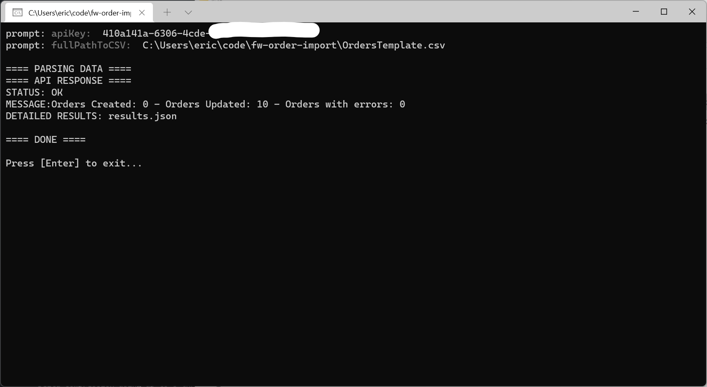

# FW Order Import Utility

1) Download the [fw-order-import.exe](https://github.com/TAC-Insight/fw-order-import/raw/main/dist/fw-order-import.exe)
- You may need to tell Windows to allow/trust the file before it will download or run.
2) Run it
3) Paste in your API key
4) Paste in the path to your CSV
5) Check the results.json file for feedback on any errors
6) Fix any errors
7) Rerun (the importer will also perform updates on any changed data)
8) Celebrate all the time you've saved!

There is a [csv template with proper formatting](https://raw.githubusercontent.com/TAC-Insight/fw-order-import/main/OrdersTemplate.csv) in this repo. Use it for reference.

Also remember that **fields containing commas must be wrapped in quotes**. Ex: "ACME, INC". The quotes will be stripped away in the import process. They tell the CSV parser that "ACME, INC" should be treated as the value for a single column.

There are required fields:
- ExternalOrderID
- RegionName
- CustomerID
- Direction (O = outbound, I = Inbound)
- PayType (C = Charge Hid $, X = Cash, S = Charge Show $, D = Credit Card, K = Check)
- Status (A = Active, I = Inactive, C = Closed)
- Description
- ProductID
- UnitPrice
- FreightRate
- HaulerRate
- FreightType (U = Unit, L = Load)
- Surcharge
- SurchargeType (U = Unit, L = Load)
- OrderProductStatus (A = Active, I = - Inactive, C = Closed)

